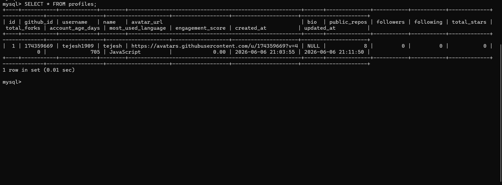
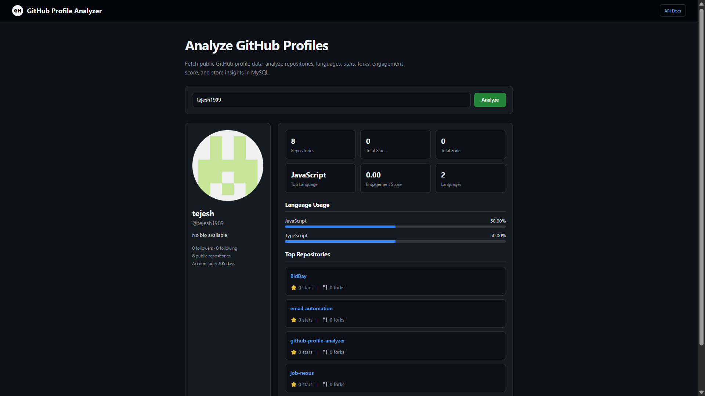
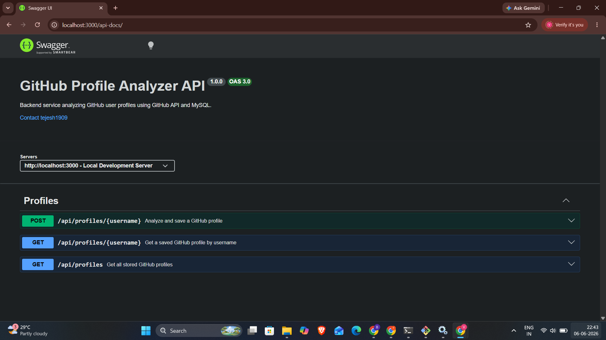

# 🚀 GitHub Profile Analyzer

An enterprise-grade Node.js & Express backend service that analyzes public GitHub profiles, calculates deep user engagement, and provides repository insights. The system is optimized for high performance using a dual-caching strategy (In-Memory + MySQL).

---

## 📸 Project Overview

| Dashboard View | Database Schema |
| :--- | :--- |
|  |  |

| Profile Analysis | API Documentation |
| :--- | :--- |
|  |  |

---

## 🎯 High-Value Features

* **Deep Language Breakdown:** Computes precise usage distribution percentages across all public repositories.
* **Top Repositories Tracking:** Automatically isolates and maps the user's top 5 repositories based on stargazers and forks.
* **Advanced Analytical Metrics:** Calculates account longevity (Account Age in Days) and a custom User Engagement Score.
* **Dual-Tier Caching Optimization:** Employs an in-memory application cache (`memory-cache`) alongside database checkpoints to minimize network latency and respect GitHub rate limits.
* **Normalized Database Schema:** Features fully linked, clean relational SQL tables handling profiles, languages, and top repositories using an isolated Data Access Object (DAO) pattern.

## ⚙️ Tech Stack

* **Runtime:** Node.js
* **Framework:** Express.js
* **Database:** MySQL (with `mysql2/promise` connection pooling)
* **Caching:** `memory-cache`
* **HTTP Client:** Axios
* **Documentation:** Swagger (OpenAPI 3.0)

## 🛠️ Installation & Setup

1. **Clone the Repository:**
   ```bash
   git clone [https://github.com/tejesh1909/github-profile-analyzer.git](https://github.com/tejesh1909/github-profile-analyzer.git)
   cd github-profile-analyzer
